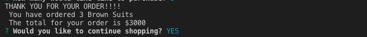
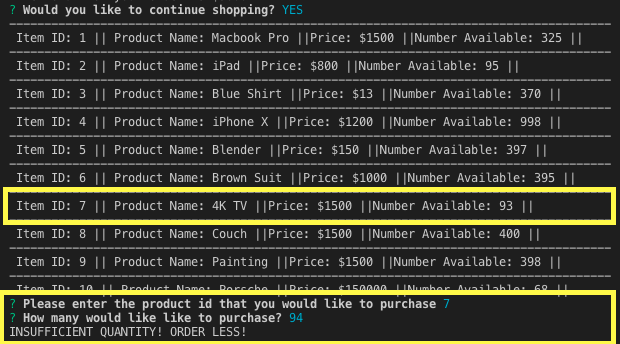

# bamazon2

This application uses Node.js as well as MySQL, and Inquirer to create a faux 'Amazon' like shopping app. 

When the application is first ran, the entire inventory in the MySQL DB displays for the user 

The user is then prompted to choose an item they would like to by using the item ID

After answer that question, the user chooses the quantity that they would like to purchse

Finally, after making their selections, the user is given an order summary that shows them the name of the product they have chosen, the quantity, and the total cost of their order. The total cost is derived from the price in the database multiplied by the quantity the user chooses to order. 

P.S. ALL ORDERS ON BAMAZON ARE TAX FREE!  

The user can chose to continue shopping by selecting yes. If they do so they are again shown the entire inventory. 
If the user attempts to over order an item, the application alerts them that they need to order less. 

This screenshot show us 2 things. The first showing that the quantity of Brown Suits has been reduced by 3 because of the order in the first screenshot above. In this scenario, the user attempts to order 94 4K TVs when there are only 93 available for sale. The app responds accorgingly. 

The app then recycles and the user is shown the inventory again and can choose an item and repeat the process. 

