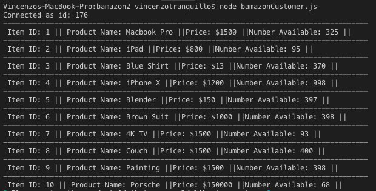

# bamazon2

This application uses Node.js as well as MySQL, and Inquirer to create a faux 'Amazon' like shopping app. 

When the application is first ran, the entire inventory in the MySQL DB displays for the user 

